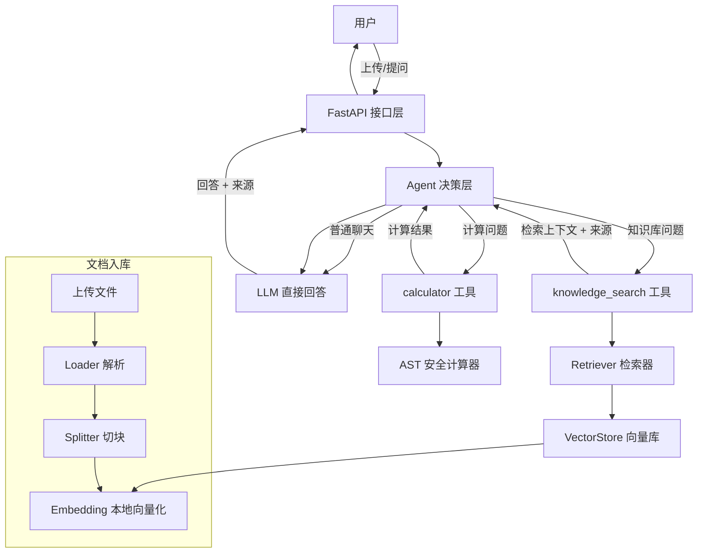

# 基于 RAG 与 Agent 的智能知识库问答系统

> 上传自己的资料（txt / pdf）即可建立知识库，提问时由 **Agent 自主判断意图**——知识库问题走检索增强生成（RAG）、计算问题走计算器工具、普通闲聊直接回答——最终返回**带来源引用**的答案。

本项目解决的核心问题：**让大模型只能依据你的私有资料回答问题，而不是凭空编造（幻觉）**，同时通过 Agent 让系统具备"判断该用什么能力"的决策层，而不是把所有问题都塞进同一条检索链路。

---

## 一、核心功能

- 📄 **资料入库**：上传 `.txt` / `.pdf`，自动解析 → 切块 → 向量化 → 建索引，元数据保留文件名与页码
- 🧠 **Agent 意图路由**：基于 LLM 工具调用，自动在「知识库检索 / 数学计算 / 直接回答」之间选择
- 🔍 **向量检索**：手写 numpy 向量库（归一化点积 = 余弦相似度），支持相似度阈值、Top-K、按来源过滤、磁盘持久化
- 📎 **真实来源引用**：回答附带 `来源文件 + 页码 + 片段`，可溯源、防幻觉
- 💬 **多轮对话**：会话历史注入 Agent，支持追问；历史持久化到 JSON
- 🧰 **工具调用可视化**：前端与 API 都返回本次调用了哪些工具
- 🖥️ **Web 界面**：资料管理 + 问答双标签页，原生零依赖

---

## 二、系统架构



**为什么用 Agent 而不是固定管线？** 固定管线对所有问题都执行"检索→LLM"，用户问"1+1 等于几"也会去空检知识库。Agent 先由 LLM 判断意图，再决定调用哪个工具（或不调工具），更贴近真实生产系统。

---

## 三、技术栈

| 层 | 技术 | 说明 |
|----|------|------|
| Web 框架 | FastAPI + Uvicorn | 异步后端、自带 OpenAPI 文档 |
| 数据校验 | Pydantic v2 | 请求/响应模型、参数校验 |
| Agent 编排 | LangChain（tool-calling Agent） | 工具调用 + 意图路由 |
| LLM | DeepSeek / 任意 OpenAI 兼容 API | `langchain-openai` 接入 |
| Embedding | sentence-transformers（BGE-small-zh） | 本地向量化，资料不出本机 |
| 向量检索 | **手写 numpy**（归一化点积） | 理解检索原理，支持阈值/过滤/持久化 |
| 切块 | LangChain RecursiveCharacterTextSplitter | 递归分隔符切分 |
| 文档解析 | pypdf | PDF 文本抽取（含页码） |
| 存储 | 本地文件（numpy 索引 + JSON 会话） | 规模需要时可平滑替换 SQLite/向量库 |
| 测试 | pytest | 单元 + API 测试 |
| 部署 | Docker / docker-compose | 一键启动 |

---

## 四、项目目录

```
agent/
├── app/
│   ├── main.py                # FastAPI 入口：组装中间件/异常处理/生命周期
│   ├── config.py              # 配置读取 + 校验（.env）
│   ├── api/
│   │   ├── routes.py          # 路由：文档/问答/会话/健康
│   │   ├── schemas.py         # Pydantic 请求/响应模型
│   │   └── deps.py            # 依赖注入（共享单例）
│   ├── agents/
│   │   └── agent.py           # RagAgent：LangChain tool-calling Agent
│   ├── rag/
│   │   ├── loader.py          # txt/pdf 解析（含页码）
│   │   ├── splitter.py        # 递归切块 + metadata
│   │   └── retriever.py       # 检索封装 + 上下文拼接
│   ├── tools/
│   │   ├── knowledge.py       # knowledge_search / calculator 工具
│   │   └── calculator.py      # AST 安全表达式求值
│   ├── storage/
│   │   ├── vector_store.py    # numpy 向量库（检索/过滤/持久化）
│   │   └── conversations.py   # 会话存储（JSON + 线程锁）
│   ├── services/
│   │   └── ingestion.py       # 入库编排：上传→解析→切块→向量化
│   ├── embeddings/
│   │   └── embedder.py        # 本地 embedding 封装
│   └── core/
│       ├── logging.py         # 统一日志 + request_id
│       └── exceptions.py      # 异常体系
├── web/
│   └── index.html             # 前端（原生 JS）
├── scripts/
│   ├── evaluate.py            # RAG 检索效果评估（Recall@K / MRR 等）
│   └── eval_questions.sample.json
├── tests/                     # pytest 测试
├── data/                      # 运行时数据（上传资料/索引/会话，已 gitignore）
├── Dockerfile / docker-compose.yml
├── requirements.txt
└── .env.example
```

---

## 五、安装运行

### 环境要求：Python 3.9+

```bash
git clone <你的仓库地址>
cd RAG-Agent
python3 -m venv venv
source venv/bin/activate            # Windows: venv\Scripts\activate
pip install -r requirements.txt
```

### 配置

```bash
cp .env.example .env
# 编辑 .env，填入 OPENAI_API_KEY（其余可用默认值）
```

### 启动

```bash
uvicorn app.main:app --host 127.0.0.1 --port 8000
```

- Web 界面：http://127.0.0.1:8000
- 交互式 API 文档（Swagger）：http://127.0.0.1:8000/docs

> 首次运行会自动下载本地 embedding 模型（约 95MB）。国内网络可设 `HF_ENDPOINT=https://hf-mirror.com`。

### Docker 一键部署

```bash
cp .env.example .env        # 填好 key
docker compose up --build
```

---

## 六、环境变量

| 变量 | 默认值 | 说明 |
|------|--------|------|
| `OPENAI_API_KEY` | 必填 | LLM API Key |
| `OPENAI_BASE_URL` | `https://api.deepseek.com` | 兼容 OpenAI 格式的 API 地址 |
| `OPENAI_MODEL` | `deepseek-chat` | 对话模型（需支持 function calling） |
| `OPENAI_EMBEDDING_MODEL` | `BAAI/bge-small-zh-v1.5` | 本地 embedding 模型 |
| `DATA_DIR` / `INDEX_DIR` | `data` / `data/index` | 资料与索引路径 |
| `CHUNK_SIZE` / `CHUNK_OVERLAP` | `500` / `100` | 切块大小与重叠（字符） |
| `TOP_K` | `5` | 检索返回块数 |
| `SIMILARITY_THRESHOLD` | `0.35` | 相似度阈值，低于则视为不相关 |
| `MAX_AGENT_ITERATIONS` | `3` | Agent 最大工具调用轮数 |

---

## 七、API 示例

| 方法 | 路径 | 说明 |
|------|------|------|
| GET | `/api/health` | 健康检查 |
| GET | `/api/status` | 知识库状态（块数/文档数） |
| POST | `/api/upload` | 上传资料（multipart `file`） |
| GET | `/api/files` | 资料列表 |
| DELETE | `/api/files/{filename}` | 删除资料 |
| POST | `/api/chat` | 无状态问答（走 Agent） |
| GET/POST | `/api/conversations` | 会话列表 / 新建 |
| GET | `/api/conversations/{id}` | 会话详情 |
| POST | `/api/conversations/{id}/ask` | 会话内提问（多轮） |
| DELETE | `/api/conversations/{id}` | 删除会话 |

**提问示例**（`POST /api/chat`）：

```bash
curl -X POST http://127.0.0.1:8000/api/chat \
  -H "Content-Type: application/json" \
  -d '{"question": "员工每年有几天年假？"}'
```

```json
{
  "ok": true,
  "answer": "根据《公司制度.pdf》，每位员工每年享有 5 天带薪年假。",
  "sources": [
    {
      "source": "公司制度.pdf",
      "page": 1,
      "score": 0.82,
      "snippet": "公司的年假制度是每位员工每年五天带薪年假"
    }
  ],
  "tool_calls": ["knowledge_search"]
}
```

**计算问题**（`POST /api/chat`）：

```json
{"question": "2 的 10 次方是多少？"}
```

```json
{
  "ok": true,
  "answer": "2 的 10 次方等于 1024。",
  "sources": [],
  "tool_calls": ["calculator"]
}
```

---

## 八、Demo

启动后按下面流程体验：

1. **资料管理**页 → 拖拽上传一个 `.txt` 或 `.pdf`
2. **问答**页 → 新建对话 → 提问（如"文档里讲了什么？"）
3. 观察回答下方的 **🧰 调用了工具** 与 **📎 参考来源**

三种意图示例：

| 提问 | Agent 行为 |
|------|-----------|
| "文档里关于 X 是怎么说的？" | 调用 `knowledge_search` → 检索 → 带来源回答 |
| "12 * 34 + 56 等于多少？" | 调用 `calculator` → 返回结果 |
| "你好，你是谁？" | 不调工具，直接回答 |

---

## 九、技术难点与解决思路

1. **如何让模型只依据私有资料回答（防幻觉）**：通过 RAG，先检索相关资料块作为上下文，并在 prompt 中强制"查不到就如实说明、不要编造"，同时返回来源引用便于核验。

2. **如何区分"该检索还是该计算"**：不写死 if-else 路由，而是用 LLM 的工具调用能力——把"知识库检索""计算器"定义为工具，让 Agent 根据问题语义自主选择，兼顾灵活性与可扩展性（新增工具只需注册一个函数）。

3. **来源引用如何定位到原始文档**：切块时把 `文件名 + 页码 + 块序号` 写进 metadata，检索结果携带该信息，最终返回结构化来源而非纯文本截断。

4. **向量检索的实现与持久化**：归一化向量做点积即得余弦相似度，用 numpy 矩阵乘法批量计算；索引落盘为 `.npy` + `chunks.json`，重启免重建。

5. **计算器如何保证安全**：用 Python `ast` 白名单解析，只放行四则运算与白名单函数，杜绝 `__import__`、`eval` 等代码注入。

6. **并发与异常安全**：会话文件读写加线程锁；统一异常体系 + 全局异常处理，避免裸 `except` 吞错；每个请求带 `request_id` 并记录延迟，便于排查。

---

## 十、优化过程（本次重构）

从最初的教学 Demo 到当前版本，关键改动：

| 维度 | 重构前 | 重构后 |
|------|--------|--------|
| 架构 | 扁平 `src/`，全塞在一个 `app.py` | 分层 `app/{api,agents,rag,tools,storage,...}` |
| Agent | 无（仅固定 RAG 管线） | LangChain tool-calling Agent + 2 个工具 |
| 切块 | 按 100 字符硬切、无边界意识 | 递归分隔符切分，默认 500 字符 |
| 元数据 | 无（来源是截断文本） | 文件名 + 页码 + 块序号 |
| 检索 | 纯 Python 双重循环余弦 | numpy 批量点积 + 阈值 + metadata 过滤 |
| 持久化 | 内存，每次重启重建 | 索引落盘，重启直接加载 |
| 多轮 | 只存历史、不注入 | 历史注入 Agent，支持追问 |
| 异常/日志 | `print` + 裸 except | 统一异常 + request_id 结构化日志 |
| 校验 | `request: dict` 裸接收 | Pydantic 模型 + 422 校验 |
| 测试 | 无 | pytest（42 例） |

---

## 十一、Evaluation（检索效果评估）

项目内置一个**只评估检索环节**的脚本（不调 LLM），统计真实指标：

```bash
python scripts/evaluate.py --questions scripts/eval_questions.sample.json --top-k 5
```

输出指标：

- **Recall@K**：Top-K 结果里命中了多少相关文档（占全部相关文档的比例）
- **Precision@K**：Top-K 结果里相关文档的比例
- **Hit@K**：Top-K 里是否至少命中一个相关文档
- **MRR@K**：第一个相关结果排名的倒数

评估问题格式（`scripts/eval_questions.sample.json`）：

```json
[
  {"question": "链表如何插入节点？", "relevant_sources": ["数据结构.txt"]}
]
```

> **说明**：本仓库未内置真实知识库与评估数据，所有指标需用你自己的资料运行后得出，README **不预先编造任何提升数字**。建议流程：先用小样本跑出 Baseline，再调 `CHUNK_SIZE` / `TOP_K` / `SIMILARITY_THRESHOLD`，对比 Recall@K 的变化。

---

## 十二、Future Work

- [ ] 混合检索：BM25 关键词 + 稠密向量（弥补纯向量对术语/数字不敏感）
- [ ] 重排序（Rerank）：Top-20 召回 → 重排 → Top-5
- [ ] Query Rewrite：口语化问题的改写
- [ ] 流式输出（SSE 打字机效果）
- [ ] 会话/文档迁移到 SQLite / PostgreSQL（多用户场景）
- [ ] 更大规模时引入 Chroma / FAISS 向量库

---

## 说明

- 本项目为个人学习与求职项目，用于深入理解并实践 **RAG + Agent 完整链路**。
- `.env` 含密钥，已被 `.gitignore` 忽略，**切勿提交**。
